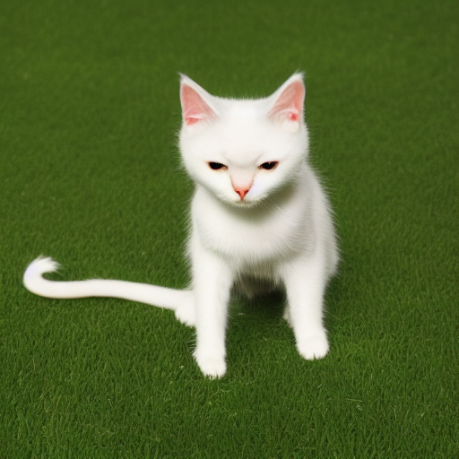
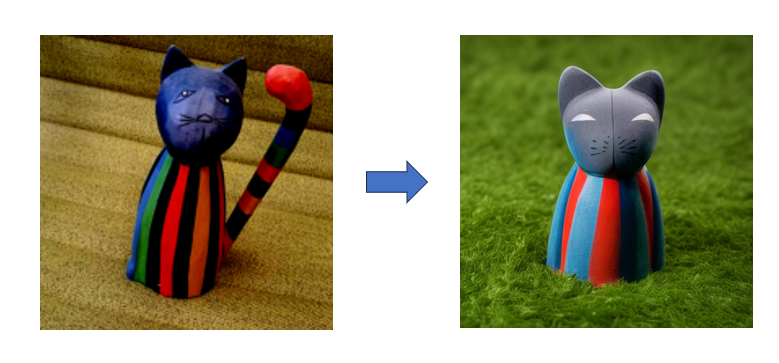

Stable Diffusion 是一种 **文本引导的潜空间扩散模型（Latent Diffusion Model, LDM）**

>本文介绍了不同的stable diffusion的微调方法

<!-- more -->

# Stable Diffusion 微调方法

| 方法                  | 怎么做（原理/操作）                                      | 训练资源需求 | 效果表现         | 适合场景                     |
| --------------------- | -------------------------------------------------------- | ------------ | ---------------- | ---------------------------- |
| **Full Fine-tuning**  | 整个模型（U-Net、VAE、CLIP）继续训练                     | 很高         | 超强（全面改造） | 训练大数据集、做全新模型     |
| **Textual Inversion** | 只训练一个新的词向量（嵌入），不改模型参数               | 极低         | 中（单一概念）   | 学特定风格、物体、小角色     |
| **DreamBooth**        | 少量图片 + 关键词绑定，微调 U-Net（有时加 Text Encoder） | 中等         | 很强（特定概念） | 个人定制（人物、宠物、角色） |
| **LoRA**              | 冻结原模型，仅训练插入的小矩阵（低秩适配层）             | 低           | 强（灵活细致）   | 快速训练风格、角色、服装设计 |
| **ControlNet**        | 微调带条件输入的辅助网络（结构分支，不动原模型主干）     | 中等         | 很强（结构控制） | 姿态、轮廓、边缘图指导生成   |

## 1. Textual Inversion

**Textual Inversion** 是一种著名的**扩散模型（如 Stable Diffusion）微调技术**，由 Google Research 于 2022 年提出。
 它的目标是：

> **用极少量的数据（通常几张图）让模型学习一个新概念（如新的人、物体、艺术风格）**。

------

**核心思路**

Textual Inversion 的本质是：

> **定义一个新的、可学习的词向量（embedding），用它引导扩散模型生成特定概念的图像。**

------

**训练流程**

1. **引入新 token**
   - 自定义一个新词，如 `"<my_cat>"`，代表你家的猫。
2. **只训练词向量**
   - 冻结模型主体（UNet、VAE、CLIP encoder），**仅优化新 token 的词向量**。
3. **优化目标**
   - 通过 prompt（如 `"A photo of <my_cat> sitting on a chair"`）生成图像，
   - 用重建损失（如 MSE Loss）让生成结果接近真实照片。
4. **训练完成后**
   - 在任意 prompt 中使用 `"<my_cat>"`，模型即可识别并正确生成！

------

**优势总结**

- **高效**：只训练一个小向量，计算开销极小。
- **稳定**：不破坏原模型的通用能力。
- **灵活**：让扩散模型学习稀有、个性化元素。

**例如：**prompt：a <cat-toy> is on the grass

没有用<cat-toy>微调：

用了<cat-toy>微调

## LoRA

**LoRA（Low-Rank Adaptation）** 是一种轻量级的**扩散模型微调技术**，最初应用在大语言模型（LLM）中，现在也广泛用于**Stable Diffusion 等扩散模型**上。

目标是：

> **在保持原模型大部分参数冻结的前提下，仅通过少量新增参数来适配新任务或新风格。**

------

## 核心思路

LoRA 的本质是：

> **在原有权重（通常是 attention 层或某些卷积层）旁边插入一个小的、可训练的低秩矩阵（Low-Rank Matrices）进行调整。**

训练时，只更新这部分新增的小矩阵，原模型参数保持不变。

------

## LoRA 在 Stable Diffusion 中的应用

- 主要微调**UNet**中的 attention 层（Cross-Attention / Self-Attention）。
- VAE、Text Encoder（CLIP）通常不微调，除非有特别需求。

------

## 训练流程

1. **插入 LoRA 层**
   - 在目标层（如 Attention 层）旁插入两个小矩阵：
     - 降维矩阵 $A$（通常是小 rank，比如 4、8）
     - 升维矩阵 $B$
2. **训练 LoRA 参数**
   - 冻结原始模型，只训练 $A$ 和 $B$。
   - Loss 几乎与普通微调一样（比如使用重建损失）。
3. **推理时合并或保持分离**
   - 可以选择将 LoRA 权重和原模型权重合并，减少推理开销；
   - 也可以动态加载，按需组合不同 LoRA 模型。

------

## 优势总结

- **极低开销**：新增参数量远小于全量微调。
- **快速训练**：适合少量数据、快速定制。
- **灵活组合**：可以在不干扰基础模型的情况下，组合多个风格/人物的 LoRA。